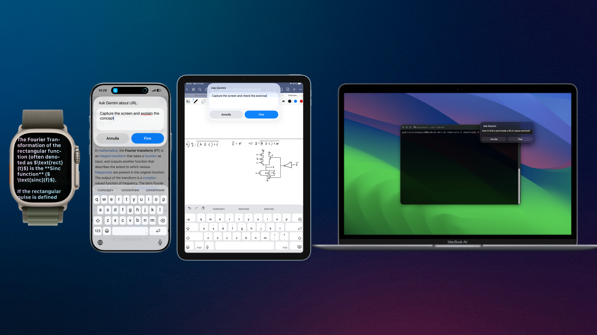
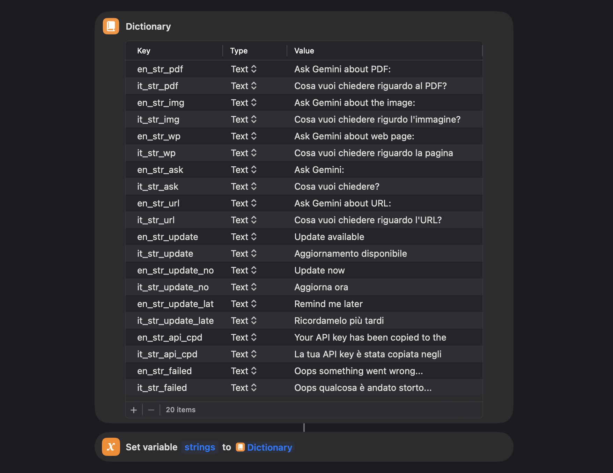
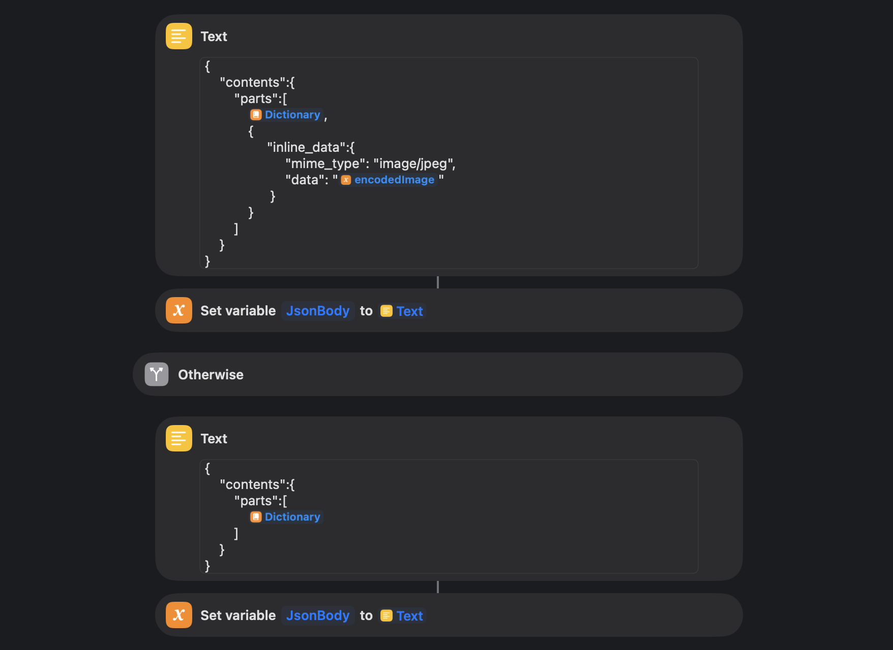
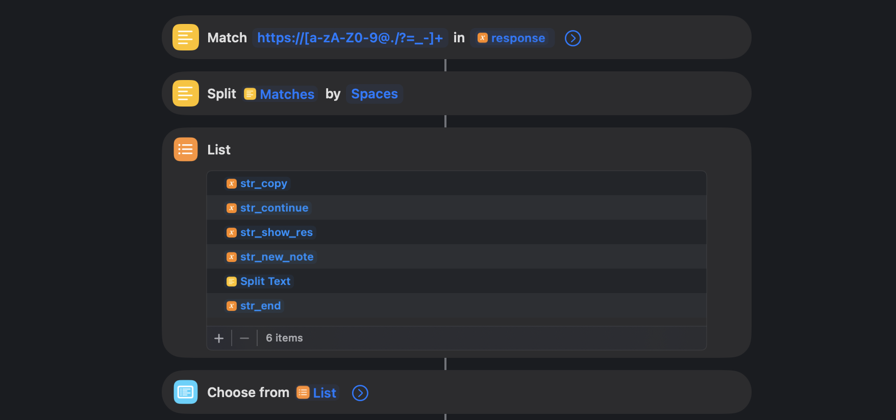

# iGemini
A powerful Apple Shortcut to seamlessly integrate Google Gemini across your entire Apple ecosystem: iOS, iPadOS, macOS, and watchOS. Bring the advanced AI capabilities of Gemini to your daily workflows, activating it from Siri, the Share Sheet (on iPhone/iPad), or directly from your Apple Watch.

## Overview
iGemini bridges the gap between **Google Gemini** and **Apple's native ecosystem**, allowing you to interact with Gemini naturally from anywhere on your device — no app switching or browser tabs required.  
It acts as a lightweight interface that sends your queries to Gemini and returns intelligent, contextual answers right inside the Apple Shortcuts environment.

## Installation

If you haven't created an API key yet, get one here:  
[https://aistudio.google.com/api-keys](https://aistudio.google.com/api-keys)

Then, download the shortcut from the official repository:  

  

Once downloaded:

1. **Tap on the downloaded file** — it will automatically open the **Shortcuts** app on your device.  
2. **Tap “Add Shortcut”** to import it.  
3. **Enter your Gemini API key** and select your **preferred language** when prompted.  
**NOTE** THAT THE LANGUAGE STRING IS **KEY SENSITIVE**, eg. for English type "en" **NOT** "En"
4. iGemini is now ready to use — you can invoke it from **Siri**, the **Share Sheet**, or your **Apple Watch**.

### Usage

iGemini can be triggered in several ways — from **Siri**, the **Share Sheet**, **Apple Watch**, or directly inside the **Shortcuts** app.  
It automatically detects the type of content you’re sharing (text, link, webpage, PDF, or image) and adapts the prompt sent to Gemini accordingly.

---

#### Quick Start

1. Run the shortcut or say **“Hey Siri, Gemini”**.  
2. Type or speak your question.  
3. Gemini will generate a response instantly.  
4. Choose what to do with the result:
   - **Copy to clipboard**
   - **Continue the conversation**
   - **Create a new note**
   - **Chose link from a list provided from Gemini**
---
 **Feature Highlight — “Capture the Screen” Mode**  
  If your input includes phrases such as **“capture the screen”**, **“take a screenshot”**, or similar, iGemini automatically takes a real-time screenshot of your device’s display, 
  that will be sent to Gemini together with your text prompt, embedding  visual analysis of your screen. 
  
  You can use it to ask context-aware questions like:  
  > “Take a screenshot and explain this error.”  
  > “Capture the screen and summarize what’s visible.”  
  > “Take a screenshot and describe the app layout.”

#### From the Share Sheet

You can invoke iGemini directly from the **Share** menu in Safari, Notes, Files, or Photos.  
Depending on the type of content, the shortcut behaves differently:

| Input Type | What Happens |
|-------------|---------------|
| **Text** | Gemini receives your selected text and answers your question about it. |
| **Link / URL** | The linked page is fetched, cleaned, and analyzed by Gemini. |
| **Web Page** | The full webpage content is extracted and summarized or explained on demand. |
| **PDF** | The text content is extracted from the PDF and sent to Gemini for analysis or summarization. |
| **Image** | The image is converted to Base64 and described or analyzed by Gemini using multimodal input. |

When the share sheet opens, simply tap **Gemini**, type your question (e.g., *“Summarize this article”*), and wait for the reply.

---

#### Conversational Mode

After receiving a response, you can tap **Continue Chat** to ask follow-up questions.  
Gemini keeps the context of the current session locally, allowing for natural back-and-forth interaction.

Example:
> You: “Summarize this article.”  
> Gemini: “It discusses the impact of AI on education…”  
> You: “Now give me three key takeaways.”  

The previous context is preserved automatically — no need to re-share the same content.

---

#### On Apple Watch

- Open **iGemini** from the Shortcuts app, complication or Siri.  
- Speak or type your question directly on your watch.  

---

#### On macOS

 Run the shortcut from the **Shortcuts** menu bar or assign it to a **keyboard shortcut**.  

---

#### Technical Flow

1. **User Input**  
   The shortcut starts by asking for user input through a text field or dictated speech.  
   The text you enter becomes the message sent to Gemini.

2. **Language and Model Setup**  
   
   On the first run, you are asked to choose a preferred language (e.g., `en`, `it`).  
   This choice determines which internal prompt structure is used (`en_str`, `it_str`, etc.).  
   The model used by default is `gemini-flash-latest`, but you can edit the shortcut to change it.

3. **Input Type Recognition**

  Before building the request, iGemini detects the kind of content you provided and adapts the payload accordingly (most detections are triggered when the Shortcut is invoked from the Share Sheet):
  
  - **Text** — Default: the text you enter or paste in the Shortcut is used as the prompt for Gemini’s text generation.  
  - **PDF** — The Shortcut extracts the PDF text (using Shortcuts’ “Get Text from PDF”/PDF parsing actions) and sends that extracted text as the content to be analyzed or summarized.  
  - **Web page / URL** — When a web page or URL is shared, iGemini attempts to fetch and extract the page content (or uses the URL as a reference) before sending it to Gemini. The exact result depends on the source and what Shortcuts can retrieve from that page.  
  - **Image** — Images are encoded in Base64 and included in the request payload (inline data) so Gemini can analyze visual content.
  
  This logic ensures the request payload matches the input type: extracted text for PDFs/pages, Base64-encoded data for images/files, and plain prompt text for simple text input.

4. **Request Construction**  

   iGemini builds a JSON payload following Gemini’s API structure:  
   - `"contents"` contains your message text.  
   - The API key and model name are inserted into the request URL:  
     `https://generativelanguage.googleapis.com/v1beta/models/{model}:generateContent?key={apiKey}`

5. **Sending the Request**  
   The Shortcut uses the `Get Contents of URL` action to send the POST request to Gemini’s endpoint.  
   The headers include `Content-Type: application/json`.

6. **Response Handling**  
   The response from Gemini is decoded from JSON.  
   The shortcut extracts the text output from the `"candidates[0].content.parts[0].text"` field.

7. **Output Presentation**
   
   The result is shown using a menu with multiple options:
   - **Show Answer** – Displays Gemini’s full response in a text view.  
   - **Continue Chat** – Reopens the input field, keeping the previous conversation context.  
   - **Copy Response** – Copies Gemini’s message to the clipboard.  
   - **View Links** – If Gemini’s response includes any URLs, they are automatically detected and listed for direct access.  
   - **Exit** – Ends the session without saving.

8. **Update Check (optional)**  
   On each run, iGemini compares its internal version number with the one available online  
   at `https://raw.githubusercontent.com/gabrielerandazzo/iGemini/main/version.json`.  
   If a newer version is found, it offers an update prompt.
---

#### Example Prompts

- “Summarize this PDF in three bullet points.”  
- “Explain this webpage as if I were a beginner.”  
- “Describe what’s in this image.”  
- “Translate this text into Italian.”  
- “Generate five video ideas based on this paragraph.”  

---

#### Updating iGemini

The shortcut periodically checks for updates from the repository.  
If a new version is available, you’ll be prompted to download it automatically.

---

#### Notes & Limitations

- The API key you enter is stored directly inside the Shortcut’s variables — it is **not encrypted or securely stored**.  Anyone with access to your Shortcuts data can view it, so handle it carefully.  
- The project is officially named **iGemini**, but the actual Shortcut file is named **Gemini** — this choice improves Siri recognition when invoking it by voice.

## Legal Notice

This project is an independent, unofficial Shortcut.
It is not affiliated with, endorsed by, or supported by Apple Inc. or Google LLC.
“Gemini” is a trademark of Google LLC.
All trademarks and product names mentioned belong to their respective owners.

## Contributors

Created by [**Gabriele Randazzo**](https://github.com/gabrielerandazzo)

Want to help improve this project?  
All contributions are welcome — bug fixes, feature ideas, and documentation improvements.

Every contributor will be credited here in future releases.

| Name | Contribution |
|------|---------------|
| [Gabriele Randazzo](https://github.com/gabrielerandazzo) | Creator & Maintainer |
| - | - |

If you’d like to contribute:
1. Fork the repository  
2. Make your changes  
3. Open a pull request  
